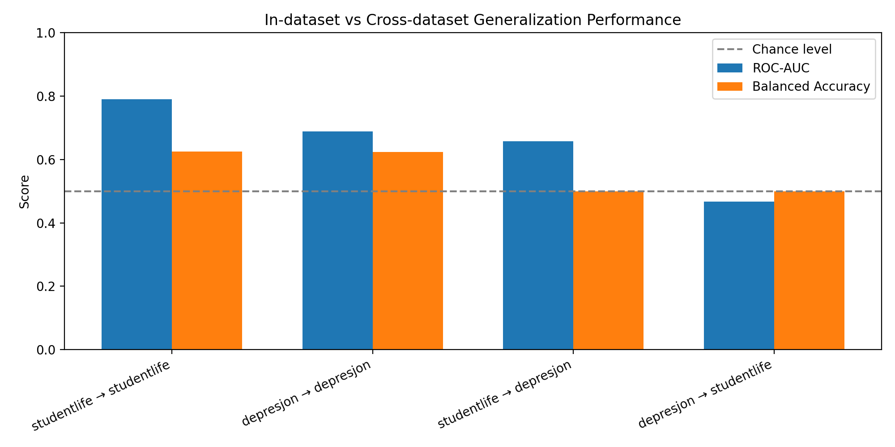

# Mental Health Generalization Benchmark

A reproducible benchmark evaluating whether mental‑health prediction models trained on passive sensing data
generalize across datasets, populations, and collection contexts.

---

## TL;DR — What this benchmark shows

**Core finding:**  
Mental‑health prediction models that appear to perform above chance within a single dataset
**do not generalize reliably** when evaluated on a different dataset, even when using
identical features, models, and evaluation protocols.

Cross‑dataset evaluation exposes a critical gap between reported performance and real‑world reliability.

---


## Benchmark claim

This repository is intentionally **not** an accuracy‑maximization project.

The goal is to evaluate whether commonly used passive‑sensing features and models
**generalize across datasets** under a frozen, leakage‑safe evaluation protocol.

Low or chance‑level cross‑dataset performance is therefore a **meaningful result**,
not a failure of implementation.

Any model claiming clinical or population‑level utility
should first demonstrate robustness under this benchmark.

---

## Core Results (Logistic Regression, Frozen Protocol)

| Train dataset | Test dataset | Setting | ROC‑AUC | Balanced accuracy |
|---|---|---|---|---|
| StudentLife | StudentLife | In‑dataset | 0.53 | 0.52 |
| Depresjon | Depresjon | In‑dataset | 0.69 | 0.62 |
| StudentLife | Depresjon | Cross‑dataset | 0.66 | 0.50 |
| Depresjon | StudentLife | Cross‑dataset | 0.47 | 0.50 |



**Key observation:**  
While ROC‑AUC may appear moderate in cross‑dataset settings, **balanced accuracy collapses to chance**,
indicating that learned decision boundaries do not transfer across datasets.

---

## Interpretation

- In‑dataset performance is **near chance**, despite standard feature engineering and widely used labels.
- Cross‑dataset evaluation reveals **non‑transferable decision thresholds**, even when features overlap.
- Feature coefficients are **not stable across datasets**, suggesting dataset‑specific correlations
  rather than robust behavioral signals.
- A random-label sanity check confirms that the evaluation pipeline does not produce above-chance
  performance when labels are destroyed, validating that observed results are not artifacts of
  data leakage or metric misuse.

These results indicate that many reported single‑dataset findings may reflect
overfitting to population‑specific or context‑specific structure.

---

## Why this matters

A large body of mental‑health machine‑learning literature reports strong performance
using passive sensing data, often without external validation.

This benchmark demonstrates that:
- Single‑dataset performance **does not guarantee robustness**
- Cross‑population transportability remains largely untested
- Deployment‑ready claims require stronger evidence than in‑dataset metrics alone

Without standardized cross‑dataset evaluation, reported accuracy can be misleading.

---

## What this repository provides

This repository offers a **leakage‑safe, reproducible benchmark pipeline** for evaluating:

- In‑dataset vs cross‑dataset generalization
- Feature overlap and stability
- Performance degradation under dataset shift
- Minimum metadata requirements for fairness analysis

The framework is designed to be extended with additional datasets, models, and sensing modalities.

---

## Repository structure (high‑level)

- `features/` — feature extraction and label construction
- `benchmarks/` — benchmark runners and result aggregation
- `models/` — baseline models (logistic regression)
- `evaluation/` — metrics and evaluation utilities
- `robustness/` — feature stability analysis
- `fairness/` — metadata availability and subgroup tooling
- `figures/` — benchmark visualizations

---

## Reproducibility

All reported results can be reproduced end‑to‑end using the provided scripts:

```bash
python features/extraction/build_feature_tables.py
python benchmarks/run.py
python benchmarks/collect_results.py
python figures/plot_benchmark_results.py
```

No manual notebook steps are required.

---

## Scope and limitations

- Datasets differ in population, sensing resolution, and label construction
- Only overlapping features are used in cross‑dataset evaluation
- Results should be interpreted as a **lower bound** on generalization performance

The goal of this benchmark is not to maximize accuracy,
but to **stress‑test generalization claims** under realistic conditions.

---

## Citation

If you use this benchmark or build upon it, please cite the repository and the original datasets
used in the evaluation.